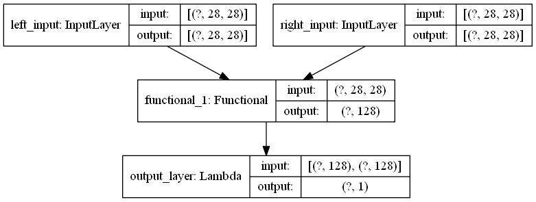

# fashion-mnist
it is the basic tensorflow problem that you can handle easily

in siamese network the base model neural networks  will look like this type

in the siamese model we are taking 2 inputs  and giving out in a single output

